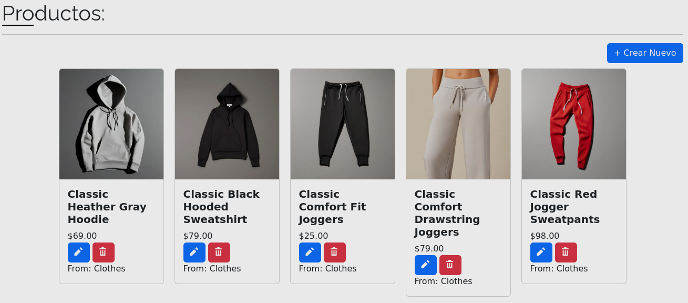

<h1> Hola! Bienvenido</h1>

Bienvenido a mi pagina!
Soy Fabian, Fullstack developer de Lima, Perú 🇵🇪.

### Contactos:
Pueden contactarme a través de mi correo:
 
jfabianabadd@gmail.com

O a través de mi número telefónico:
 
[+51 922266582](tel:922266582)

### Tecnologías con las que programo:

## Algunos de mis principales Proyectos:

### Frontend:

### 1. [Larahost](https://guiacalidad.com.pe/larahost)
Frontend para el negocio Larahost hecha con Html, Css y Javascript

Link al repositorio de Github: https://github.com/Abad-Dev/Front-LaraHost

<a href="https://larahost.net/" target="_blank">

    

</a>

### 2. [GuiaCalidad](https://guiacalidad.com.pe)
Front Page para el negocio Guiacalidad hecha con Wordpress

<a href="https://guiacalidad.com.pe" target="_blank">

    

</a>

### 3. [Front-On](https://fronton.com.pe)
Página y Catálogo para el negocio Front-On hecha con Wordpress

<a href="https://fronton.com.pe" target="_blank">

    

</a>

### 4. [Humanase](https://humanase.com)
Página para el negocio Humanase hecha con Svelte SPA-Router

Link al repositorio de Github: https://github.com/Abad-Dev/SPARouter-Svelte-Pages/tree/humanase

<a href="https://humanase.com" target="_blank">

    

</a>

### 5. [Eleomartt](https://eleomartt.com)
Página para el negocio Eleomartt hecha con Svelte

Link al repositorio de Github: https://github.com/Abad-Dev/Eleomartt

<a href="https://eleomartt.com" target="_blank">

    

</a>

### 6. BlazorWASM
Proyecto personal de un curso de Platzi que usa una API para hacer un CRUD, todo con Blazor Web Assembly.

Link al repositorio de Github: https://github.com/Abad-Dev/WASM-Platzi

<a href="https://github.com/Abad-Dev/WASM-Platzi" target="_blank">

    

</a>

### 7. [Clean](https://guiacalidad.com/clean)
Proyecto personal en forma de juego donde practico mis habilidades con Svelte.

Link al repositorio de Github: https://github.com/Abad-Dev/clean

<a href="https://larahost.net/clean" target="_blank">

    

</a>

### Backend

### 8. [NetDynamicPress](https://larahost.net/clean)
Backend para una aplicación de Creación de presupuestos, CRUD completo hecho con .NET y documentado con Swagger.

Link al repositorio de Github: https://github.com/Abad-Dev/NetDynamicPress

    

### 9. [GuiaBack]()
Backend para una aplicación basada en anunciantes, usa base de datos MySQL. Hecha con la librería FastAPI y documentada con Swagger.

Link al repositorio de Github: https://github.com/Abad-Dev/GuiaBack

    

